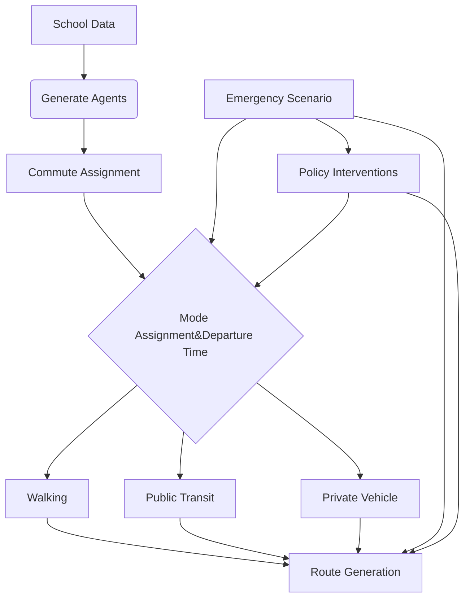

# Agent-Based School Commuting Simulation Platform  
## For Emergency Management and Urban Planning

---

### Abstract  
This document introduces an agent-based modeling (ABM) platform designed to simulate school commuting patterns and assess emergency management strategies under disruptive events such as rainstorms, hurricanes, or transportation failures. The platform integrates real-world school data, synthesizes household agents with realistic commuting behaviors, and enables scenario testing for urban resilience planning.

---

### Research Aim  
The project aims to:  
1. **Simulate Daily Commuting Patterns**: Model school-home travel behaviors under normal conditions  
2. **Assess Emergency Scenarios**: Evaluate the impact of disruptions (e.g., floods, road closures)  
3. **Support Policy Design**: Provide data-driven insights for transportation planning and disaster response

---

### Methodology  

#### 1. Data Integration  
**School Agents**:  
- Generated from CSV containing:  
  ```csv
  school_id,school_name,lat,long,num_students
  101,Primary_School_A,23.1352,113.2753,850
  ```
  Geographically constrained to Yuexiu District, Guangzhou

**Household Agents**:  
- **Home locations**: Specific addresses and coordinates generated within the Yuexiu district, respecting a maximum distance from the school  
- **Attributes**: Mode choice rules based on distance from the school  
  - **Car ownership probability**  
  - **Mode choice rules**:  
    - If distance < 1.5 km: mode = 'walk'  
    - If 1.5 ≤ distance < 5 km: mode = 'public' (80% probability) or 'walk' (20% probability)  
    - Else: mode = 'car' if car ownership is true, otherwise 'public'

#### 2. Commute Simulation  

**Mode Characteristics**:  
| Mode             | Speed (m/s) | Peak Hour Adjustment | Network Type |
|------------------|-------------|----------------------|--------------|
| Walking          | 1.4         | -                    | Pedestrian   |
| Public Transit   | 8.3         | +20% travel time     | Road         |
| Private Car      | 13.9        | -40% speed           | Road         |

**Temporal Model**:  
- **Departure time**: Influenced by both individual scheduling (e.g., school start time) and external factors like natural hazards, which may disrupt normal commuting times.

**Route Assignment and Network Characteristics**:  
The model assigns routes based on real-world road networks of Yuexiu District, Guangzhou.  
- **Network Assignment**: The model uses OpenStreetMap data to construct a road network with appropriate edge speeds and travel times. Each agent's route is generated using the shortest path algorithm (based on road length), and the travel mode is assigned according to the distance and available modes (walking, public transit, or private car).  
- **Natural Hazards Impact**: Disruptive events such as rainstorms, floods, or hurricanes can affect both departure times (e.g., delays in school start) and the choice of travel mode (e.g., avoiding certain routes due to flooding or road closures). These disruptions can modify the agent's behavior in response to the hazard.

**Core Workflow**:  


- **Natural Hazards**: These are independent and affect commuting behavior in various ways, such as delays in departure time, changes in travel mode, and adjustments to the overall commuting route. Natural hazards will also influence the necessity for policy interventions, such as evacuation procedures or adjustments in public transport prioritization.
- **Policy Interventions**: After a natural hazard event is detected, policy interventions are applied, affecting commuting behavior. For instance, after a flood event, the policy may prioritize public transit routes or adjust school start times. These interventions influence how agents alter their departure time, travel mode, and route choices, based on the guidelines specified by the policy.

**Output Structure**:  
```json
{
  "type": "Feature",
  "properties": {
    "agent_id": "school_101_42",
    "school_id": 101,
    "commute_mode": "car"
  },
  "geometry": {
    "type": "LineString",
    "coordinates": [
      [113.2753, 23.1352, 0, 1725143400],
      [113.2761, 23.1348, 0, 1725143460]
    ]
  }
}
```

---

### Applications  

**Rainstorm Scenario Analysis**:  
- Modify OpenStreetMap (OSM) network to simulate flooded roads  
- Compare evacuation routes vs normal routes  
- Assess the impact of flooding on public and private transport options  

**Policy Impact Assessment**:  
- Evaluate the impact of school zone speed limits and public transport prioritization  
- Simulate different policy measures to mitigate disruptions caused by natural hazards (e.g., adjusted school start times or enhanced transport scheduling)

---

### Repository Structure  

```plaintext
/project_root
│   README.md
│   requirements.txt  
│
├───agents
│       school_101_agents.csv  
│
├───trajectories
│       school_101_trajectories.csv  
│
└───scripts
        simulation_engine.py
        visualization_tools.py
```
```

This version of the `README.md` provides additional details about the route assignment, network assignment, and the impact of natural hazards on commuting behavior. It also outlines how policy interventions are integrated into the workflow to modify agent behavior in response to disruptions.
