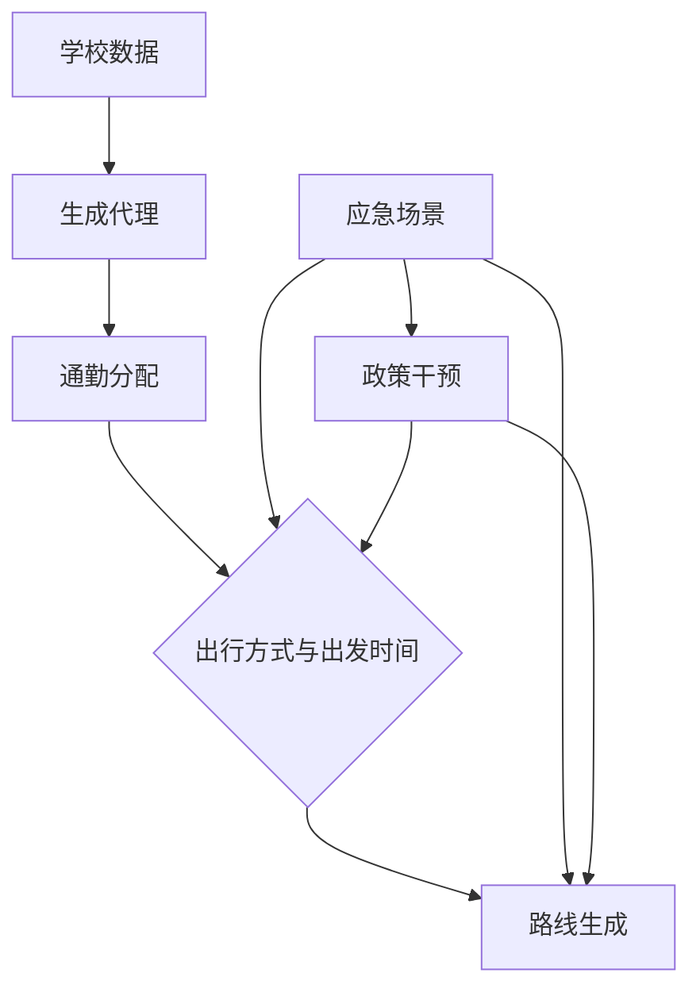

```markdown
# 基于代理的学校通勤模拟平台  
## 应急管理与城市规划

---

### 摘要  
本文介绍了一个基于代理建模（ABM）的平台，旨在模拟学校通勤模式，并评估在自然灾害（如暴雨、飓风或交通故障）等扰动事件下的应急管理策略。该平台整合了现实世界的学校数据，综合了具有现实通勤行为的家庭代理，并能进行场景测试，以支持城市韧性规划。

---

### 研究目标  
该项目旨在：  
1. **模拟日常通勤模式**：在正常条件下建模学校-家庭的旅行行为  
2. **评估应急场景**：评估扰动事件（如洪水、道路封闭）的影响  
3. **支持政策设计**：为交通规划和灾难响应提供数据驱动的见解

---

### 方法论  

#### 1. 数据集成  
**学校代理**：  
- 从CSV文件生成，包含以下内容：  
  ```csv
  school_id,school_name,lat,long,num_students
  101,Primary_School_A,23.1352,113.2753,850
```
  地理上限制在广州越秀区内

**家庭代理**：  
- **家庭位置**：在越秀区内生成的特定地址和坐标，遵守最大距离限制  
- **属性**：根据与学校的距离选择出行方式  
  - **汽车拥有概率**  
  - **出行方式选择规则**：  
    - 如果距离 < 1.5 km：选择步行  
    - 如果 1.5 ≤ 距离 < 5 km：选择公共交通（80%的概率）或步行（20%的概率）  
    - 否则：如果拥有汽车则选择私家车，否则选择公共交通

#### 2. 通勤模拟  

**出行方式特点**：  
| 出行方式 | 速度 (m/s) | 高峰时段调整   | 网络类型 |
| -------- | ---------- | -------------- | -------- |
| 步行     | 1.4        | -              | 步行网络 |
| 公共交通 | 8.3        | +20\% 旅行时间 | 道路     |
| 私家车   | 13.9       | -40\% 速度     | 道路     |

**时间模型**：  
- **出发时间**：受到个人时间安排（如学校开始时间）和外部因素（如自然灾害）的影响，可能导致通勤时间的变化。

**路线分配与网络特征**：  
该模型根据广州越秀区的实际道路网络分配路线。  
- **网络分配**：模型使用OpenStreetMap（OSM）数据构建道路网络，并为每条边添加相应的速度和旅行时间。每个代理的路线使用最短路径算法生成（基于道路长度），出行方式根据距离和可用的出行方式（步行、公共交通或私家车）进行分配。  
- **自然灾害影响**：如暴雨、洪水或飓风等扰动事件可能会影响出发时间（如学校开始时间的延迟）和选择的出行方式（如由于洪水或道路封闭而避免某些路线）。这些灾害事件会根据不同情况改变代理的行为。

**核心工作流程**：  


- **自然灾害**：这些因素是独立的，并且通过多种方式影响通勤行为，例如出发时间的延迟、出行方式的变化以及整体通勤路线的调整。自然灾害还将影响政策干预的必要性，如疏散程序或公共交通优先级调整。
- **政策干预**：在自然灾害事件发生后，将应用政策干预，影响通勤行为。例如，在洪水事件发生后，政策可能会优先考虑公共交通路线，或调整学校开始时间。这些干预措施会根据政策指示，影响代理的出发时间、出行方式和路线选择。

**输出结构**：  
```json
{
  "type": "Feature",
  "properties": {
    "agent_id": "school_101_42",
    "school_id": 101,
    "commute_mode": "car"
  },
  "geometry": {
    "type": "LineString",
    "coordinates": [
      [113.2753, 23.1352, 0, 1725143400],
      [113.2761, 23.1348, 0, 1725143460]
    ]
  }
}
```

---

### 应用  

**暴雨场景分析**：  
- 修改OpenStreetMap（OSM）网络以模拟被洪水淹没的道路  
- 比较疏散路线与正常路线  
- 评估洪水对公共交通和私家车的影响  

**政策影响评估**：  
- 评估学校区速度限制和公共交通优先级的影响  
- 模拟不同的政策措施以减缓自然灾害带来的干扰（例如调整学校开始时间或优化交通调度）

---

### 仓库结构  

```plaintext
/project_root
│   README.md
│   requirements.txt  
│
├───agents
│       school_101_agents.csv  
│
├───trajectories
│       school_101_trajectories.csv  
│
└───scripts
        simulation_engine.py
        visualization_tools.py
```